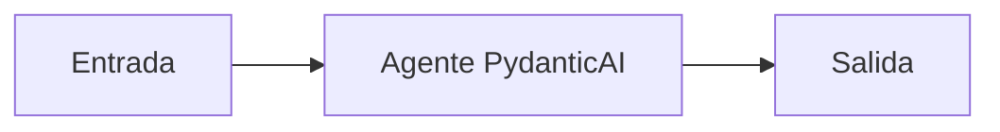

# Agente PydanticAI

## Objetivo

Crea un agente tipado mínimo.

## Explicación

Las instrucciones definen rol; la ejecución produce una respuesta controlada.

## Práctica

Cambiá la instrucción y compará salida.
