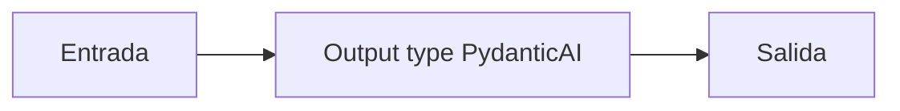

# Output type PydanticAI

## Objetivo

Restringe la salida del agente con un modelo Pydantic.

## Explicación

El schema controla forma, no reemplaza verificación de hechos.

## Práctica

Agregá un campo obligatorio.
