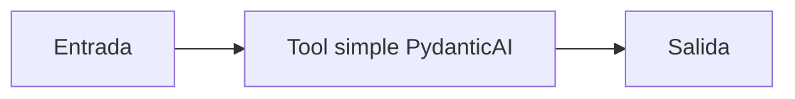

# Tool simple PydanticAI

## Objetivo

Registra una capacidad local para un agente.

## Explicación

La función ofrece el dato o cálculo; el agente decide cuándo usarla.

## Práctica

Probá otro argumento.
