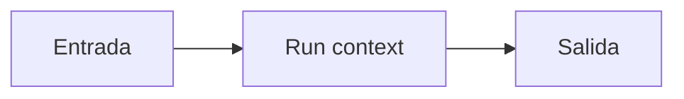

# Run context

## Objetivo

Entrega dependencias explícitas durante la ejecución.

## Explicación

El contexto evita esconder clientes y configuración como variables globales.

## Práctica

Identificá qué dependencia debe viajar en contexto.
