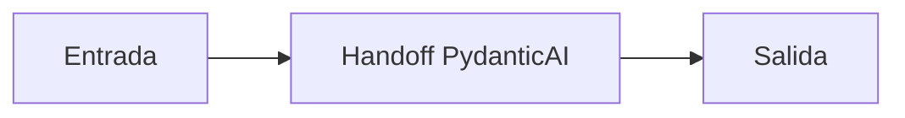

# Handoff PydanticAI

## Objetivo

Transfiere una tarea entre agentes tipados.

## Explicación

El contrato de salida de un agente debe servir como input del siguiente.

## Práctica

Dibujá qué datos viajan en el handoff.
