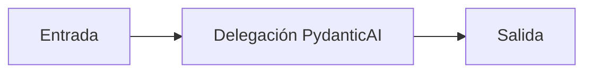

# Delegación PydanticAI

## Objetivo

Divide una tarea entre roles especializados.

## Explicación

Delegar ayuda solo cuando la división reduce ambigüedad y es auditable.

## Práctica

Explicá qué tarea no requiere multiagente.
