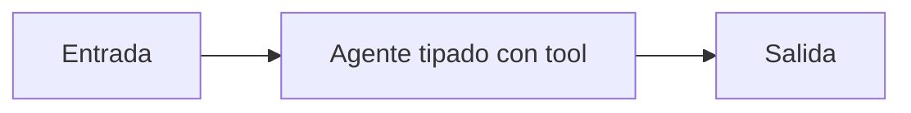

# Agente tipado con tool

## Objetivo

Integra agente, tool y salida Pydantic.

## Explicación

La salida final debe conservar evidencia de la consulta realizada.

## Práctica

Cambiá la tool y validá el contrato.
