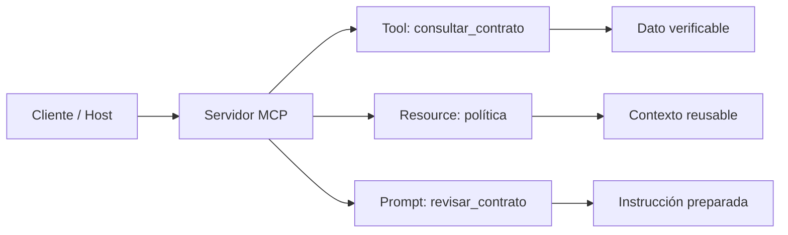

# 00 — Catálogo MCP: tool, resource y prompt

## Qué problema resuelve

`00_catalogo_mcp.py` presenta el contrato básico de Model Context Protocol. Un servidor MCP no es un modelo: publica capacidades con nombres y formatos que otros clientes, hosts o agentes pueden descubrir y reutilizar.



## Recorrido del código

### 1. El catálogo local representa una fuente de verdad

```python
catalogo = {"C-100": "vigente", "C-200": "en revisión"}
```

El diccionario reemplaza una base de datos para que el ejemplo sea corto. Lo importante es la separación: el estado contractual vive fuera del modelo de lenguaje. Un LLM puede explicarlo, pero no debería inventarlo.

### 2. La dependencia se controla sin romper la clase

```python
try:
    from mcp.server import MCPServer
except ImportError:
    MCPServer = None
```

El `try/except` está justificado pedagógicamente: si falta el SDK, el archivo explica qué componente no está disponible en lugar de mostrar un traceback confuso. Cuando `MCPServer` existe, se construye el servidor; cuando no, se imprime la demo local.

### 3. Tool = acción o consulta ejecutable

```python
@servidor.tool()
def consultar_contrato(codigo: str) -> str:
    return catalogo.get(codigo, "contrato inexistente")
```

La decoración publica una función. La entrada es `codigo` y la salida es el estado. Una tool se llama para producir un resultado; puede consultar datos, ejecutar un cálculo o, con mayores controles, producir efectos externos.

### 4. Resource = contexto direccionable

```python
@servidor.resource("contratos://politica")
def politica() -> str:
    return "Las bajas requieren revisión humana."
```

Un resource tiene URI y entrega información para leer. Aquí la política no depende de un código de contrato. A diferencia de la tool, se ofrece como contenido reutilizable y no como una acción que el modelo decide ejecutar.

### 5. Prompt = plantilla de interacción

```python
@servidor.prompt()
def revisar_contrato(codigo: str) -> str:
    return f"Revisá el contrato {codigo} usando la política disponible."
```

Un prompt parametrizado prepara la instrucción de una tarea repetida. No es un dato fuente ni una operación; guía a un cliente sobre cómo abordar una interacción.

| Primitiva | Input típico | Output | Cuándo usarla |
|---|---|---|---|
| Tool | Argumentos | Resultado de operación | Obtener estado, buscar, calcular o actuar. |
| Resource | URI | Contexto de lectura | Políticas, documentos, configuración. |
| Prompt | Parámetros | Mensajes/instrucción | Flujos conversacionales repetibles. |

## Rol de LangChain en este caso

`ChatOpenAI` explica la diferencia entre las primitivas, pero no publica MCP ni consulta el catálogo. Esta separación es clave: MCP define una interfaz de capacidades; LangChain puede orquestarlas dentro de una aplicación de agentes.

## Práctica

Agregá `C-300: "vencido"`. Después decidí si una política de bajas debe ser resource, tool o prompt y justificá según el tipo de entrada y resultado.
