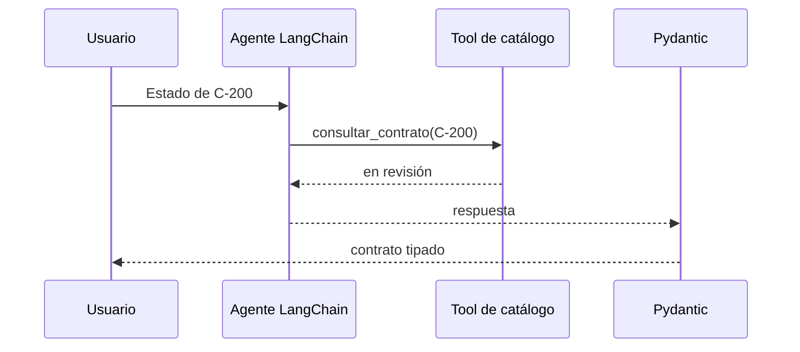

# 01 — Agente LangChain que consulta un catálogo

## Qué problema resuelve

Este script muestra un agente que debe consultar una tool antes de responder sobre el estado de un contrato. La tool ofrece el dato verificable; el agente orquesta la interacción y Pydantic deja una salida estable para otra aplicación.



## Recorrido paso a paso

### 1. Schema de salida

```python
class RespuestaCatalogo(BaseModel):
    codigo: str
    estado: str
    requiere_revision: bool
```

El schema diferencia hecho (`estado`) de decisión operacional (`requiere_revision`). La aplicación no recibe un párrafo impredecible: recibe campos que puede mostrar, almacenar o usar para routing.

### 2. Tool local con forma reutilizable

```python
@tool
def consultar_contrato(codigo: str) -> str:
    return {"C-100": "vigente", "C-200": "en revisión"}.get(codigo, "inexistente")
```

`@tool` registra la función como capacidad invocable por LangChain. Aunque esta implementación es local, tiene la misma intención que una tool que luego podría exponerse desde MCP: recibir argumentos explícitos y devolver un resultado verificable.

### 3. Crear el agente y declarar el límite

```python
agente = create_agent(
    model="openai:gpt-4.1-mini",
    tools=[consultar_contrato],
    system_prompt="Consultá la tool y respondé solo con el estado obtenido.",
)
```

La lista `tools` hace disponible la función. El prompt de sistema no aporta datos contractuales: obliga al agente a obtenerlos desde la tool. Esto reduce alucinación, aunque conviene validar el resultado del agente en código cuando la operación es sensible.

### 4. Ejecutar y reconstruir una salida confiable

El agente devuelve un historial de mensajes; el ejemplo toma el último contenido. Luego Python crea `RespuestaCatalogo` y calcula `requiere_revision` usando el estado. Esa última regla es determinista: no se delega al LLM.

| Componente | Responsabilidad | No debería hacer |
|---|---|---|
| Tool | Devolver estado del catálogo | Explicar políticas libremente. |
| Agente | Decidir cuándo consultar | Inventar un estado. |
| Python | Calcular regla `revisión` | Adivinar datos ausentes. |
| Pydantic | Validar forma final | Validar que el catálogo sea verdadero. |

## Punto importante para clase

El contenido final del mensaje del agente puede incluir estilo o texto adicional. Por eso el ejemplo vuelve a tipar el resultado y fija `codigo` y `requiere_revision` desde código. El caso 06 amplía este patrón con tres estados y respuesta estructurada del agente.

## Práctica

Consultá `C-100` y un código inexistente. Verificá que la tool produce el hecho y que la regla Python transforma ese hecho en una decisión previsible.
