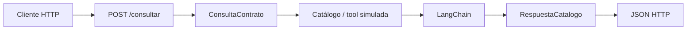

# 02 — Exponer el agente mediante FastAPI

## Qué problema resuelve

`02_api_agente.py` convierte la lógica de catálogo en un servicio HTTP. FastAPI representa la frontera con una interfaz web; LangChain genera una explicación; Pydantic valida tanto lo que entra como lo que sale.



## Recorrido paso a paso

### 1. Definir los dos contratos HTTP

```python
class ConsultaContrato(BaseModel):
    codigo: str = Field(min_length=3)

class RespuestaCatalogo(BaseModel):
    codigo: str
    estado: str
    requiere_revision: bool
    explicacion_agente: str
```

`ConsultaContrato` valida la petición: códigos demasiado cortos producen una respuesta 422 de FastAPI antes de entrar a la lógica. `RespuestaCatalogo` documenta el JSON que la API promete devolver.

### 2. Declarar la aplicación y una ruta de salud

```python
app = FastAPI(title="Resumen L3: agente MCP")

@app.get("/salud")
def salud() -> dict[str, str]:
    return {"estado": "ok"}
```

La ruta `/salud` permite comprobar que el servidor vive sin depender de una consulta con LLM. En producción, un health check puede incluir conectividad, pero aquí se mantiene simple.

### 3. El endpoint recibe un objeto, no JSON sin forma

```python
@app.post("/consultar", response_model=RespuestaCatalogo)
def consultar(consulta: ConsultaContrato) -> RespuestaCatalogo:
```

FastAPI convierte el JSON a `ConsultaContrato`. `response_model` documenta, filtra y valida la salida. Esa doble frontera evita que un cambio accidental devuelva información que el cliente no espera.

### 4. Separar el hecho del texto generado

El diccionario local simula la tool MCP y fija `estado`. La llamada `modelo.invoke(...)` solo genera `explicacion_agente`. `requiere_revision` se calcula por regla Python. Así un LLM no decide silenciosamente el estado ni la política de revisión.

| Capa | Input | Output | Control |
|---|---|---|---|
| HTTP | JSON del cliente | `ConsultaContrato` | `min_length=3`. |
| Catálogo | Código | Estado | Fuente de verdad. |
| LangChain | Estado ya verificado | Explicación | Prompt acotado. |
| HTTP | `RespuestaCatalogo` | JSON | `response_model`. |

## Cómo ejecutarlo

Desde esta carpeta, ejecutá `uvicorn 02_api_agente:app --reload`. Después abrí `http://127.0.0.1:8000/docs`, probá `GET /salud` y enviá a `POST /consultar`:

```json
{"codigo": "C-200"}
```

## Debate docente

¿Qué ocurriría si la tool MCP no responde? Una API real debe devolver un error claro, registrar la falla y no usar un texto generado como reemplazo del estado contractual.
