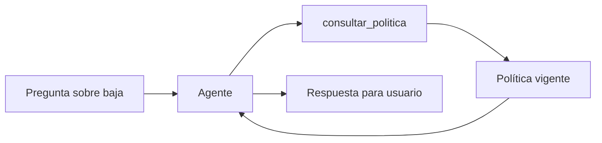

# 04 — Agente que consulta una política contractual

## Qué problema resuelve

Este caso es un agente mínimo que responde sobre políticas sin inventarlas. La política vive en una tool local; LangChain debe consultarla antes de explicarla.



## Recorrido paso a paso

### 1. La tool concentra la política

```python
@tool
def consultar_politica(tema: str) -> str:
    return {"baja": "Las bajas requieren revisión humana.", ...}.get(...)
```

La función tiene un argumento explícito, `tema`, y una única responsabilidad: buscar una regla. En una implementación real podría llamar un resource MCP, una base de políticas o un gestor documental; el agente no necesita conocer dónde vive el dato.

### 2. El sistema obliga a consultar

```python
agente = create_agent(
    model="openai:gpt-4.1-mini",
    tools=[consultar_politica],
    system_prompt="Consultá la tool antes de explicar una política contractual.",
)
```

El prompt define comportamiento, mientras que `tools` define capacidades disponibles. No son lo mismo: un buen prompt sin herramienta no aporta la política; una herramienta sin instrucción puede no ser usada de manera consistente.

### 3. La respuesta es un mensaje final

`agente.invoke` recibe el historial en el formato `messages`. El ejemplo imprime el contenido del último mensaje para conservar el código corto. En una API, convendría tipar la respuesta y guardar también la política consultada para auditoría.

| Pieza | Aporta | No garantiza |
|---|---|---|
| Tool | Regla vigente en el catálogo | Que la fuente esté actualizada. |
| Agente | Explicación con lenguaje natural | Que no agregue interpretación excesiva. |
| Prompt | Límite de uso | Cumplimiento perfecto sin pruebas. |

## Práctica

Preguntá por `plazo` y luego por un tema inexistente. Discutí qué debería responder el sistema: una política no encontrada no debe convertirse en una regla inventada.
