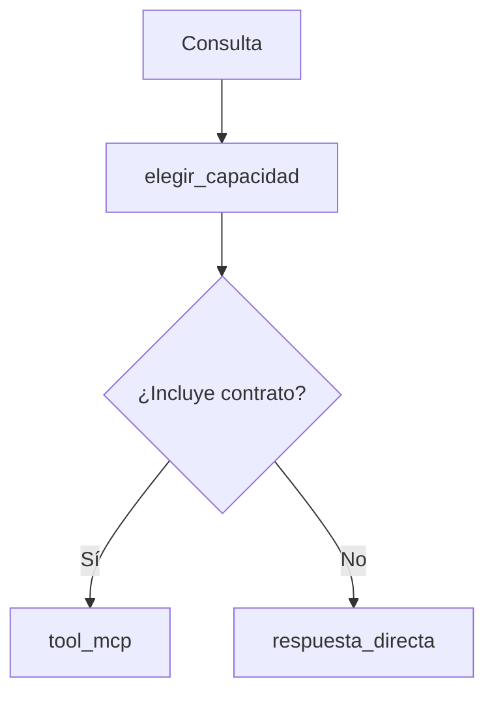

# 05 — Routing determinista hacia una tool MCP

## Qué problema resuelve

Este es el routing más pequeño de L3. Decide si una consulta debe buscar una capacidad contractual o puede recibir respuesta directa. No usa LLM: la regla está en Python para que se pueda probar y auditar.



## Recorrido paso a paso

### 1. Estado de entrada y actualización

```python
class EstadoConsulta(TypedDict):
    consulta: str
    destino: NotRequired[str]
```

Al iniciar solo existe el texto de `consulta`. El nodo agrega `destino`. El tipo hace visible qué dato se espera y cuál aparecerá durante el recorrido.

### 2. Una regla simple y visible

```python
return {"destino": "tool_mcp" if "contrato" in state["consulta"].lower() else "respuesta_directa"}
```

`lower()` evita que mayúsculas alteren el routing. La condición usa una palabra clave; no entiende sinónimos ni contexto. Eso es bueno para el ejercicio: permite observar exactamente por qué se eligió un camino.

| Consulta | Destino | Motivo |
|---|---|---|
| “Estado del contrato C-200” | `tool_mcp` | Contiene la palabra clave. |
| “¿Qué es MCP?” | `respuesta_directa` | No necesita catálogo contractual. |
| “Estado de la adenda” | `respuesta_directa` | Muestra el límite de una regla literal. |

### 3. LangGraph documenta el paso

`START → elegir_capacidad → END` parece pequeño, pero separa política de routing de las herramientas y del LLM. En el siguiente nivel, `tool_mcp` y `respuesta_directa` se conectarían a subgrafos distintos.

## Extensión razonable

Antes de reemplazar la condición por un LLM, agregá palabras clave o un clasificador pequeño con salida tipada. Si se usa un LLM para routing, se debe registrar su decisión y ofrecer un fallback cuando no esté seguro.
