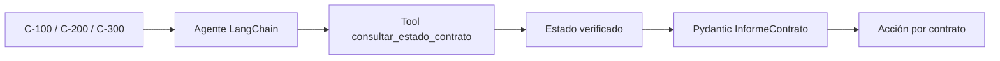

# 06 — Agente LangChain con varias consultas de catálogo

## Qué problema resuelve

Este integrador usa una misma tool con tres contratos y genera una salida uniforme. Enseña el patrón principal de agente: **la tool entrega el hecho; el agente lo comunica; Python conserva las reglas críticas**.



## Recorrido paso a paso

### 1. Contrato final de la aplicación

```python
class InformeContrato(BaseModel):
    codigo: str = ""
    estado: str = ""
    accion: str = ""
    explicacion: str
```

La interfaz puede depender de los cuatro campos sin interpretar un chat completo. El agente genera especialmente `explicacion`; el código fija `codigo`, `estado` y `accion` con datos y reglas verificables.

### 2. Tool con fuente aislada

```python
@tool
def consultar_estado_contrato(codigo: str) -> str:
    catalogo = {"C-100": "vigente", "C-200": "en revisión", "C-300": "vencido"}
    return catalogo.get(codigo, "inexistente")
```

La tool no decide qué hacer: devuelve un estado. Esto permite cambiar la fuente por una tool MCP o una API sin obligar a reescribir la lógica de presentación.

### 3. Agente con salida estructurada

```python
agente = create_agent(
    model="openai:gpt-4o-mini",
    tools=[consultar_estado_contrato],
    response_format=InformeContrato,
    system_prompt="Consultá siempre la tool antes de responder...",
)
```

`response_format` pide la forma Pydantic. El prompt traduce estados en recomendaciones, pero el ejemplo no confía completamente en esa traducción para la acción final.

### 4. Doble comprobación de estado y acción

Después de invocar el agente, Python llama explícitamente a `consultar_estado_contrato.invoke`. Luego el diccionario `accion_verificada` asigna una acción determinista. Por último, `model_validate` combina explicación del agente con campos verificados.

| Estado de tool | Acción fijada por Python | Razón |
|---|---|---|
| `vigente` | `continuar` | No hay bloqueo declarado. |
| `en revisión` | `revisión humana` | Se requiere intervención. |
| `vencido` | `no avanzar` | El contrato no debe continuar. |
| `inexistente` | `no avanzar` | No existe evidencia contractual. |

### 5. Tres iteraciones comparables

El `for` repite el mismo flujo para los tres códigos. Esto permite mostrar que una herramienta no solo aporta contexto: puede cambiar la decisión sin modificar el prompt ni el modelo.

## Pregunta de seguridad

¿Por qué se vuelve a consultar la tool después del agente? Porque la acción es crítica y el código no debe depender de que el agente haya reflejado el estado con exactitud. En un diseño más eficiente se podría guardar la observación de tool del agente, siempre que sea trazable y validada.
