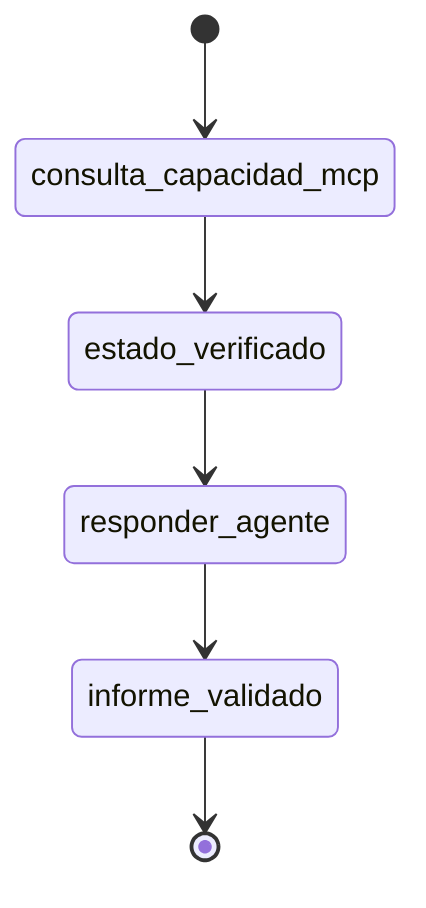
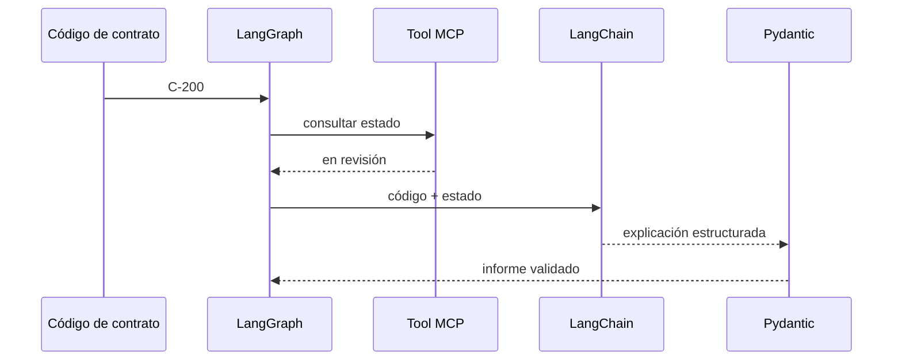

# 07 — Handoff MCP → agente en LangGraph

## Qué problema resuelve

Este es el integrador final de L3. Divide consulta verificable y explicación en dos nodos, conserva todo en estado y produce un contrato Pydantic por cada código. El grafo hace visible el handoff que un agente simple puede ocultar.



## Recorrido paso a paso

### 1. Estado y actualizaciones parciales

```python
class EstadoContrato(TypedDict):
    codigo: str
    estado: NotRequired[str]
    informe: NotRequired[dict[str, object]]
```

El estado inicial solo exige el código. `ActualizacionEstado` documenta que el primer nodo aporta `estado`; `ActualizacionInforme` documenta que el segundo aporta el contrato final. Los tipos evitan que un nodo modifique campos sin declararlo.

### 2. Primer nodo: capacidad MCP representada localmente

```python
def consultar_capacidad_mcp(state: EstadoContrato) -> ActualizacionEstado:
    return {"estado": catalogo.get(state["codigo"], "inexistente")}
```

Este nodo no redacta ni toma una decisión. Su única tarea es resolver el hecho contractual. La implementación local imita la respuesta que ofrecería una tool MCP; reemplazarla por una conexión real no debería cambiar el resto del grafo.

### 3. Segundo nodo: respuesta condicionada por evidencia

El nodo usa `state.get("estado", "inexistente")` para incluir el resultado verificado en el prompt. Luego genera una explicación estructurada y reemplaza campos críticos con el código, estado y acción calculados desde el diccionario `acciones`.

```python
acciones = {
    "vigente": "continuar",
    "en revisión": "revisión humana",
    "vencido": "no avanzar",
    "inexistente": "no avanzar",
}
```

| Datos que llegan al agente | Datos que Python controla |
|---|---|
| Código y estado obtenido | Estado final impreso. |
| Instrucción para explicar | Acción según política. |
| Contexto para `explicacion` | Forma final mediante Pydantic. |

### 4. Aristas y ejecución

```python
START → consultar_capacidad_mcp → responder_agente → END
```

`compile()` crea la aplicación ejecutable. El bucle invoca el mismo grafo para `C-100`, `C-200` y `C-300`, y `cast` informa a Pylance que el resultado vuelve a tener la forma de `EstadoContrato`.



## Cierre de L3

El paso fundamental no es usar un grafo por moda. Es hacer demostrable que el agente recibió el dato de la capacidad antes de comunicar una acción. Este patrón puede ampliarse con transportes MCP reales, autenticación, logs, errores y herramientas remotas, que están en las demás carpetas de L3.
