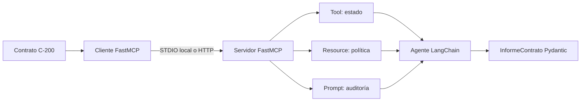

# Caso 08 — Agente LangChain con FastMCP publicado

## Objetivo

Este es el caso integrador **real** de L3. El agente no usa una tool local ni
un catálogo copiado en el script. Primero abre un cliente FastMCP, consume una
tool, un resource y un prompt del servidor. Después LangChain interpreta esa
evidencia y Pydantic valida la salida.



## Modos de conexión

| Modo | Configuración | Cuándo usarlo |
|---|---|---|
| STDIO real | No definir `FASTMCP_CONTRATOS_URL` | Desarrollo y clase en una sola máquina. |
| HTTP publicado | Definir `FASTMCP_CONTRATOS_URL=http://127.0.0.1:8001/mcp/` | El MCP ya está levantado como servicio. |

Ambos modos usan el protocolo MCP. La diferencia es el transporte; no existe
un fallback simulado. Si falta `OPENAI_API_KEY`, el script explica qué variable
configurar y no inventa un informe.

> Si el servidor se publica en Internet o se consume desde una web, debe usarse
> su endpoint **HTTPS Streamable HTTP** (`https://tu-dominio/mcp/`). STDIO es
> únicamente el modo local para clase y desarrollo.

## Ejecución

```powershell
# Desde la raíz del curso.
.\.venv\Scripts\python.exe .\03_extras\L3_mcp_y_agentes\resumen\08_agente_fastmcp_real.py
```

Para probar HTTP, primero publicá el servidor de la carpeta `fastmcp`, colocá
la URL en `.env` y ejecutá exactamente el mismo archivo.

## Qué debe observarse

El JSON final debe tener cuatro campos. `estado` debe provenir del MCP y
`accion_recomendada` debe respetar su resource de política. Por ejemplo, para
`C-200` el agente debe recomendar revisión humana, no firma automática.

## Práctica

Cambiá el código solicitado a `C-300`. Explicá por qué el agente bloquea la
firma: el cambio de conclusión ocurre por evidencia del MCP, no por modificar
el prompt del agente.
