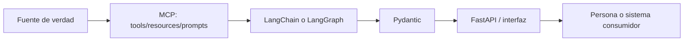

# Teoría transversal — L3: MCP, APIs y agentes

## Mapa de la lecture

| Capa | Pregunta que responde | Ejemplo de L3 |
|---|---|---|
| MCP | ¿Qué capacidad puedo descubrir o reutilizar? | Consultar contrato, leer política, usar prompt. |
| Tool | ¿Qué hecho o acción necesito? | Estado de `C-200`. |
| Resource | ¿Qué contexto puedo leer? | Política de bajas. |
| Prompt | ¿Qué interacción se repite? | Revisar un contrato con política. |
| LangChain | ¿Cómo orquesto modelo y tools? | Agente que consulta catálogo. |
| LangGraph | ¿Qué pasos y handoffs deben ser explícitos? | Tool → métrica/estado → agente. |
| Pydantic | ¿Qué forma final prometo? | `InformeContrato`. |
| FastAPI | ¿Cómo lo expongo por HTTP? | `POST /consultar`. |

## Principio de diseño

El modelo no debe ser la fuente de verdad. Una tool, resource, API o base de datos aporta el hecho; el modelo interpreta o redacta sobre ese hecho. Las decisiones críticas deben conservar reglas visibles y validaciones.

## Orden pedagógico

1. MCP básico: tool, resource y prompt.
2. LangChain: agente que usa una tool.
3. Pydantic: contrato estable.
4. FastAPI: frontera HTTP.
5. LangGraph: estado, nodos, routing y handoff.
6. Integrador: herramienta verificable antes de la respuesta.

## Riesgos y controles

| Riesgo | Control |
|---|---|
| El modelo inventa un estado | Consultar tool y conservar respuesta. |
| La salida cambia de forma | Pydantic y structured output. |
| El agente salta una etapa | Grafo con aristas explícitas. |
| La API recibe datos inválidos | Modelos Pydantic de entrada. |
| Una política queda desactualizada | Resource/versionado y fuente de verdad. |
