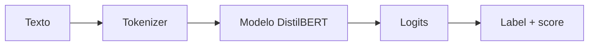

# 00 — Clasificación con `pipeline`

## Objetivo

`00_pipeline_clasificacion.py` usa la interfaz de alto nivel de Hugging Face. Un `pipeline` reúne tokenizador, modelo y postproceso para probar una tarea sin construir cada pieza a mano.



## Paso a paso

```python
clasificador = pipeline("text-classification", model="...", device=-1)
resultados = clasificador(textos)
```

La tarea selecciona clasificación de texto. El modelo fue ajustado para sentimiento en inglés; por eso las frases de ejemplo también están en inglés. `device=-1` lo ejecuta en CPU. Cada resultado incluye una etiqueta y un score asociado a la predicción.

| Pieza | Qué oculta `pipeline` |
|---|---|
| Tokenización | Texto a IDs y máscaras. |
| Modelo | Inferencia sobre tensores. |
| Postproceso | Logits a etiqueta y score. |

## Límite importante

Un score no es una certeza universal ni una evaluación legal de una cláusula. Solo es la confianza relativa del clasificador de sentimiento para su entrenamiento específico.

## Práctica

Modificá `fair` por `unfair`. Observá que la tarea y el modelo permanecen iguales; solo cambia el input.
