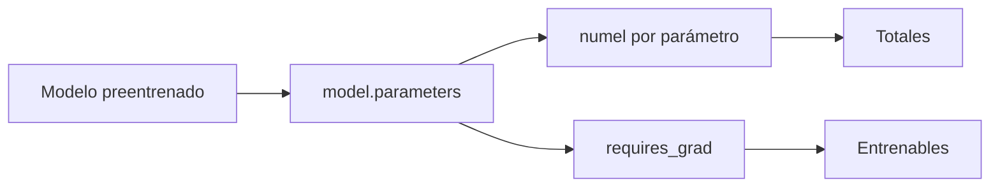

# 01 — Inspeccionar parámetros antes de adaptar

## Objetivo

Este script cuenta parámetros totales y entrenables de un BERT pequeño. Es el punto de partida para entender por qué full fine-tuning y PEFT/LoRA tienen costos distintos.



## Paso a paso

```python
parametros_totales = sum(p.numel() for p in modelo.parameters())
parametros_entrenables = sum(p.numel() for p in modelo.parameters() if p.requires_grad)
```

`numel()` cuenta elementos de cada tensor. Antes de congelar capas, todos tienen `requires_grad=True`, por lo que total y entrenable coinciden. El porcentaje muestra qué fracción recibiría gradientes durante entrenamiento.

| Métrica | Pregunta que responde |
|---|---|
| Totales | ¿Qué tamaño tiene el modelo? |
| Entrenables | ¿Cuánto se actualiza en este experimento? |
| Porcentaje | ¿Cuánto reduce adaptación parcial? |

## Conexión con LoRA

LoRA agrega matrices pequeñas entrenables y congela pesos base. Luego de aplicar PEFT, los parámetros totales cambian poco, pero los entrenables deberían caer mucho. L5 profundiza esa adaptación.

## Práctica

Congelá una capa con `requires_grad=False` y recalculá. Nunca asumas ahorro: contalo.
