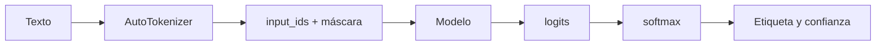

# Recorrido explícito por un Transformer

## Objetivo

`recorrido_transformer.py` abre lo que el pipeline oculta: tokenización, tensores de entrada, logits, softmax y etiqueta. Es el puente entre teoría de L4 e inferencia real.



## Paso a paso

### 1. Tokenizador y modelo compatibles

El mismo `nombre_modelo` se usa para ambos. Eso garantiza que los IDs producidos por el tokenizador pertenecen al vocabulario que el modelo espera.

### 2. Crear tensores

```python
entradas = tokenizer(texto, return_tensors="pt")
tokens = tokenizer.convert_ids_to_tokens(entradas["input_ids"][0])
```

`return_tensors="pt"` produce tensores PyTorch. `input_ids` contiene los números del vocabulario y normalmente incluye tokens especiales. Convertirlos de vuelta a texto permite estudiar la fragmentación.

### 3. Inferencia sin gradientes

```python
with torch.no_grad():
    salida = modelo(**entradas)
```

Durante inferencia no se necesitan gradientes. `no_grad()` reduce memoria y trabajo. `**entradas` entrega al modelo todos los campos necesarios, como IDs y máscara.

### 4. Logits a probabilidades

`salida.logits` son puntajes sin normalizar. `softmax(..., dim=-1)` los convierte en probabilidades que suman 1 por ejemplo. `argmax` obtiene el índice mayor e `id2label` lo traduce a etiqueta.

| Objeto | Significado |
|---|---|
| `input_ids` | Tokens numéricos. |
| `logits` | Evidencia sin normalizar por etiqueta. |
| `probabilidades` | Distribución relativa de etiquetas. |
| `id2label` | Traducción de índice a nombre. |

## Práctica

Cambiá `fair` por `unfair`. Compará tokens y probabilidades: un cambio de texto puede modificar ambos, pero la tokenización no equivale al significado completo.
