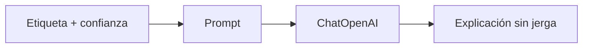

# 00 — Explicar una inferencia con LangChain

## Objetivo

Este archivo comienza después del Transformer. Recibe una etiqueta y confianza ya calculadas y genera una explicación breve para una persona. LangChain comunica; no sustituye el modelo de clasificación.



## Paso a paso

```python
resultado_transformer = {"etiqueta": "POSITIVE", "confianza": 0.96}
prompt = ChatPromptTemplate.from_template("Explicá este resultado sin jerga: {resultado}")
cadena = prompt | ChatOpenAI(model="gpt-4o-mini", temperature=0)
```

El diccionario es evidencia producida antes. El prompt delimita la tarea de comunicación. El operador `|` conecta el generador de mensajes con el modelo; `invoke` ejecuta recién cuando recibe el diccionario.

| Capa | Responsabilidad |
|---|---|
| Transformer | Etiqueta y score. |
| Prompt | Pedir lenguaje claro. |
| LangChain | Orquestar la llamada. |
| Persona | Decidir cómo usar la predicción. |

## Riesgo

Una explicación fluida puede hacer que un score parezca una certeza. Debe conservarse la predicción original y aclarar que depende del modelo, datos y tarea usados.

## Práctica

Cambiá a `NEGATIVE` y confianza `0.55`. Compará cómo una confianza moderada debería comunicarse con mayor cautela.
