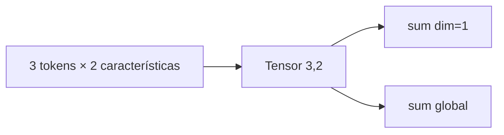

# 00 — Tensores: forma antes que cálculo

## Objetivo

`00_tensores.py` presenta el contenedor numérico de PyTorch. En Transformers, los tensores representan lotes, posiciones de tokens, embeddings, máscaras y pesos.



## Paso a paso

```python
tokens = torch.tensor([[1.0, 0.0], [0.5, 0.5], [0.0, 1.0]])
```

La forma es `(3, 2)`: tres filas, una por token, y dos columnas, una por característica. `tokens.sum(dim=1)` conserva filas y reduce columnas; `tokens.sum()` reduce todas las dimensiones a un escalar.

| Operación | Entrada | Salida | Lectura |
|---|---|---|---|
| `shape` | `(3, 2)` | Dimensiones | Tres tokens con dos valores. |
| `sum(dim=1)` | Cada fila | `(3,)` | Una suma por token. |
| `sum()` | Todo tensor | Escalar | Total global. |

## Conexión con L4

Antes de interpretar una operación de atención, conviene declarar shapes. La mayoría de errores de Transformer son desalineaciones de dimensiones, no errores de “inteligencia” del modelo.

## Práctica

Cambiá a `dim=0`. Explicá por qué ahora se suman los tres tokens para cada característica.
