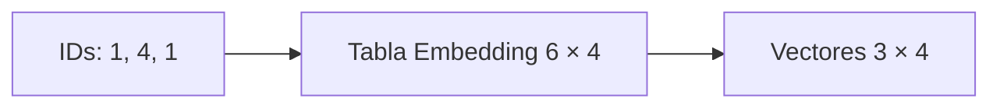

# 01 — Embeddings: IDs a vectores

## Objetivo

`01_embeddings.py` convierte IDs discretos de vocabulario en vectores densos entrenables. Un ID identifica una entrada; su embedding es la representación numérica que recibe el Transformer.



## Paso a paso

```python
tabla_embeddings = torch.nn.Embedding(num_embeddings=6, embedding_dim=4)
ids = torch.tensor([1, 4, 1])
vectores = tabla_embeddings(ids)
```

La tabla contiene seis filas posibles y cuatro números por fila. Al consultar tres IDs, la forma de salida es `(3, 4)`. Los IDs repetidos, `1` y `1`, recuperan exactamente la misma fila mientras los pesos no cambien.

| Parámetro | Significado |
|---|---|
| `num_embeddings=6` | Tamaño del vocabulario de ejemplo. |
| `embedding_dim=4` | Dimensión latente por token. |
| `ids` | Índices a buscar en la tabla. |
| `torch.equal` | Comprueba que IDs iguales producen mismo vector. |

## Teoría

Durante entrenamiento los valores de la tabla se ajustan por gradiente. Un embedding no es una definición textual: es un vector cuya utilidad depende de la tarea y de los datos.

## Práctica

Cambiá `embedding_dim` a 2. El número de tokens no cambia, pero la última dimensión sí: `(3, 2)`.
