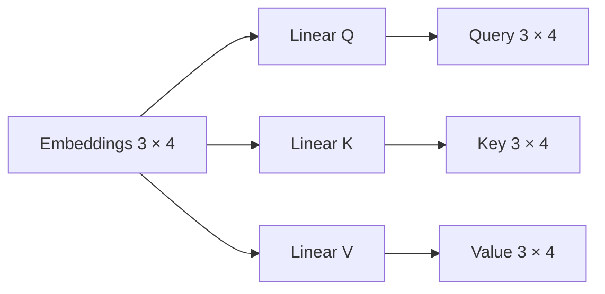

# 00 — Query, Key y Value

## Objetivo

`00_query_key_value.py` muestra que Q, K y V son tres proyecciones distintas de los mismos embeddings. Esa separación permite formular preguntas, compararlas con claves y mezclar valores.



## Paso a paso

`torch.randn(3, 4)` simula tres tokens de dimensión 4. Las tres capas `Linear(4, 4, bias=False)` tienen pesos independientes. Por eso conservan shape `(3, 4)` pero normalmente generan valores diferentes.

```python
query = proyeccion_q(embeddings)
key = proyeccion_k(embeddings)
value = proyeccion_v(embeddings)
```

| Proyección | Pregunta conceptual | Uso siguiente |
|---|---|---|
| Q | ¿Qué contexto busca esta posición? | Se compara con K. |
| K | ¿Con qué características coincide cada posición? | Produce scores. |
| V | ¿Qué información aporta cada posición? | Se mezcla con pesos. |

## Práctica

Usá salida de dimensión 2. Q, K y V pasan a `(3, 2)`; para multiplicar `Q @ K.T`, ambas deben tener la misma dimensión final.
