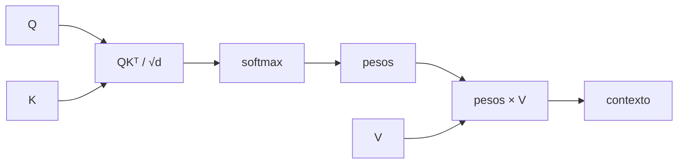

# 01 — Self-attention escalada

## Objetivo

Este script implementa la fórmula central de atención con matrices pequeñas: similitud Q–K, escalado, softmax y mezcla de V.



## Paso a paso

```python
scores = query @ key.T / math.sqrt(query.shape[-1])
pesos = torch.softmax(scores, dim=-1)
contexto = pesos @ value
```

`query @ key.T` crea una matriz `(3, 3)`: cada fila consulta y cada columna es una clave posible. Dividir por `√d` estabiliza magnitudes. `softmax(dim=-1)` hace que cada fila de pesos sume uno. Finalmente cada contexto es una combinación ponderada de los Values.

| Objeto | Forma | Propiedad que verificar |
|---|---|---|
| `scores` | `(3, 3)` | Similitudes sin normalizar. |
| `pesos` | `(3, 3)` | Cada fila suma aproximadamente 1. |
| `contexto` | `(3, 2)` | Misma dimensión de Value. |

## Límite

Los Q, K y V están escritos a mano; en un Transformer real provienen de proyecciones aprendidas, como en el script anterior.

## Práctica

Modificá un vector `Value`. Los scores no cambian, pero sí el contexto: muestra que atención separa “dónde mirar” de “qué traer”.
