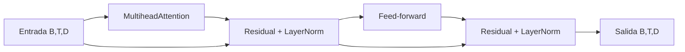

# Bloque Transformer mínimo

## Objetivo

`bloque_transformer.py` integra atención, conexión residual, LayerNorm y red feed-forward. Es una versión pequeña de un bloque encoder que conserva la forma de la secuencia.

## Paso a paso

`entrada` tiene shape `(1, 3, 4)`: un lote, tres tokens y dimensión 4. La atención contextualiza tokens sin cambiar esa forma. Luego `entrada + salida_atencion` conserva información original mediante residual y `LayerNorm` estabiliza sus valores.

La red feed-forward usa `4 → 8 → 4`: expande cada posición y vuelve a la dimensión original. Se aplica por token, no mezcla tokens; la mezcla de contexto ocurrió en atención.

| Componente | Función |
|---|---|
| MultiheadAttention | Mezcla información entre posiciones. |
| Residual | Preserva camino directo y ayuda gradientes. |
| LayerNorm | Normaliza características por token. |
| Feed-forward | Transforma características de cada token. |

## Práctica

Cambiá `num_heads` a 2. `embed_dim=4` funciona porque 4 es divisible por 2; cada head recibe dimensión 2.
