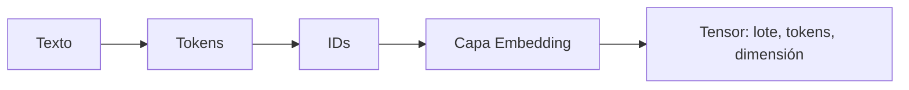

# 00 — De texto a embeddings

## Idea central

Este caso recorre la primera parte de un Transformer: texto → tokens → IDs → vectores. Los tokens identifican unidades discretas; los embeddings son vectores aprendibles que permiten al modelo operar numéricamente.



## Recorrido del código

### 1. Tokenización didáctica

```python
tokens = texto.split()
ids = list(range(1, len(tokens) + 1))
```

`split()` cuenta palabras para que la secuencia sea visible. No es el tokenizador real de BERT o GPT: esos usan subwords. Los IDs consecutivos son una simulación; un vocabulario real asigna IDs fijos y reutilizables.

### 2. Capa de embeddings

```python
embedding = torch.nn.Embedding(num_embeddings=20, embedding_dim=4)
vectores = embedding(torch.tensor([ids]))
```

La capa contiene una tabla de 20 vectores. Cada ID busca una fila de dimensión 4. `torch.tensor([ids])` agrega dimensión de lote: una sola frase con varios tokens.

| Forma | Significado |
|---|---|
| `(1, 4)` | Un lote con cuatro IDs. |
| `(1, 4, 4)` | Un lote, cuatro tokens, cuatro valores por embedding. |
| `(B, T, D)` | Forma habitual antes de atención: batch, tokens, dimensión. |

### 3. Fallback docente

Si PyTorch no está instalado, el script conserva una forma esperada. Eso permite explicar dimensiones sin presentar un traceback, pero no es cálculo real de embeddings.

### 4. LangChain solo explica

`ChatOpenAI` recibe `forma_vectores` y la traduce a una oración. No calcula los vectores ni reemplaza PyTorch. Esta separación se mantiene en toda L4: cálculo local primero, explicación del LLM después.

## Práctica

Agregá una palabra. Solo debería aumentar `T`, la dimensión de secuencia; `D=4` no cambia porque es una decisión de arquitectura.
