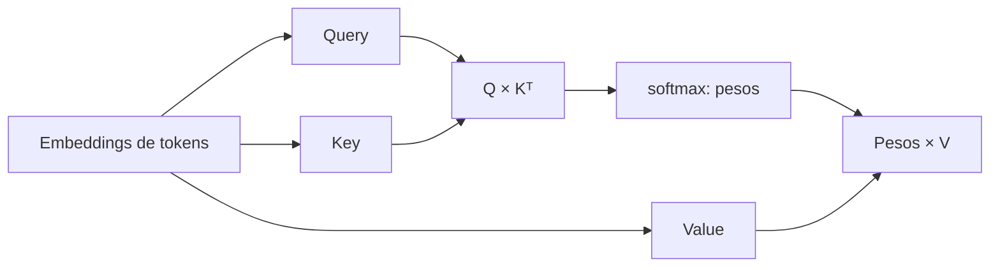

# 01 — Self-attention en una cláusula

## Idea central

Self-attention permite que cada token compare su representación con los demás tokens de la misma entrada. No es una búsqueda literal de palabras: construye pesos que indican cuánto contexto usa cada posición.



## Recorrido del código

### 1. Secuencia y representación

```python
tokens = ["contrato", "vence", "mañana"]
entrada = torch.randn(1, 3, 4)
```

La entrada simula un lote de una secuencia de tres tokens y dimensión de embedding 4. `manual_seed(7)` fija números aleatorios para que la demostración sea repetible.

### 2. Una capa de atención

```python
capa = torch.nn.MultiheadAttention(embed_dim=4, num_heads=1, batch_first=True)
_, pesos = capa(entrada, entrada, entrada)
```

Pasar `entrada` tres veces significa que Query, Key y Value provienen de la misma secuencia: eso es self-attention. `num_heads=1` deja un solo patrón para que la lectura sea simple.

| Variable | Papel |
|---|---|
| Query | Qué busca el token actual. |
| Key | Con qué se compara cada token. |
| Value | Información que se mezcla según los pesos. |
| `pesos` | Relación token a token. |

### 3. Leer la forma

La forma `(1, 3, 3)` significa un lote, tres tokens que consultan y tres tokens posibles a los que atender. Una secuencia de cuatro tokens produce `(1, 4, 4)`: el costo de atención estándar crece aproximadamente con `T²`.

## Límite del ejemplo

Los pesos aleatorios no muestran comprensión semántica real. Sirven para estudiar dimensiones y operación. La comprensión aparece después de entrenar proyecciones y capas sobre muchos ejemplos.
