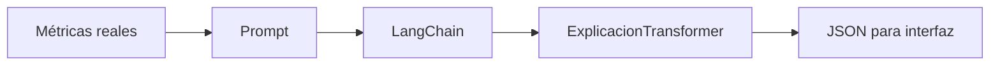

# 02 — Explicar métricas sin reemplazar el Transformer

## Idea central

Este caso toma métricas ya calculadas y las transforma en una explicación tipada. Enseña una frontera sana: el Transformer/PyTorch calcula; LangChain comunica para una persona; Pydantic controla el formato.



## Recorrido del código

`metricas = {"tokens": 4, "forma_atencion": "(1, 4, 4)"}` representa evidencia que un cálculo anterior produjo. El schema obliga a que la explicación conserve ambos valores.

```python
class ExplicacionTransformer(BaseModel):
    tokens: int
    forma_atencion: str
    explicacion: str
```

`with_structured_output` pide esos tres campos. Después `model_dump()` permite enviar el resultado a una API, dashboard o cuaderno.

| Campo | Fuente correcta | Uso |
|---|---|---|
| `tokens` | Tokenizador/cálculo | Tamaño de secuencia. |
| `forma_atencion` | Tensor PyTorch | Dimensiones de relaciones. |
| `explicacion` | LLM | Traducción pedagógica. |

## Riesgo a discutir

Un schema puede asegurar que aparezca `tokens=4`, pero no prueba que sea el valor real. Por eso los campos se deben fijar desde cálculo propio o validar contra métricas antes de entregar una respuesta.

## Práctica

Cambiá a 8 tokens y `(1, 8, 8)`. Pedí al alumno que anticipe qué costo crece y por qué la explicación no cambia la matemática.
