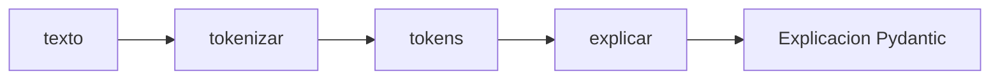

# 03 — LangGraph: tokenizar y luego explicar

## Idea central

El grafo hace explícito el orden: primero Python tokeniza; después el LLM explica la cantidad. El estado permite demostrar qué nodo creó cada dato.

## Recorrido del código

`EstadoTransformer` empieza con `texto`; `tokens` y `explicacion` son `NotRequired` porque aparecen durante el flujo. El nodo `tokenizar` devuelve solo `{"tokens": ...}`. LangGraph integra esa actualización al estado existente.

El nodo `explicar` calcula `len(state.get('tokens', []))`, prepara un prompt y usa `with_structured_output(Explicacion)`. El LLM no recibe el texto como audio ni calcula embeddings: solo recibe resultado explícito del nodo anterior.

| Nodo | Lee | Agrega | Motivo |
|---|---|---|---|
| `tokenizar` | Texto | Lista de tokens | Cálculo determinista. |
| `explicar` | Texto + tokens | Explicación | Comunicación pedagógica. |

`START → tokenizar → explicar → END` evita que la explicación se produzca antes de tener la métrica. En casos mayores se agregaría un nodo de tokenizador real y otro de atención.

## Práctica

Reemplazá la frase por una más larga. Seguí el estado tras cada nodo y comprobá qué campo cambió.
