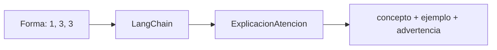

# 04 — Tutor tipado de self-attention

## Idea central

Este caso usa un LLM como tutor: recibe una forma de matriz y genera concepto, ejemplo y advertencia. Es útil para enseñar, no para calcular atención real.

## Recorrido del código

`forma_atencion = "(1, 3, 3)"` es evidencia de entrada. El schema define tres perspectivas complementarias: qué es el concepto, un ejemplo legible y una advertencia para no sobreinterpretar pesos.

| Campo | Aporta |
|---|---|
| `concepto` | Definición corta de self-attention. |
| `ejemplo` | Lectura aplicada a tres tokens. |
| `advertencia` | Límite: los pesos no son explicación causal completa. |

`with_structured_output` evita que la explicación salga como texto desordenado. Aun así, la forma debe originarse en PyTorch u otro cálculo real. El LLM puede explicar una matriz, pero no demuestra que el modelo “entendió” una cláusula.

## Práctica

Probá `(1, 8, 8)` y compará con `(1, 3, 3)`. El concepto es igual; la cantidad de relaciones posibles aumenta de 9 a 64 por head y por ejemplo.
