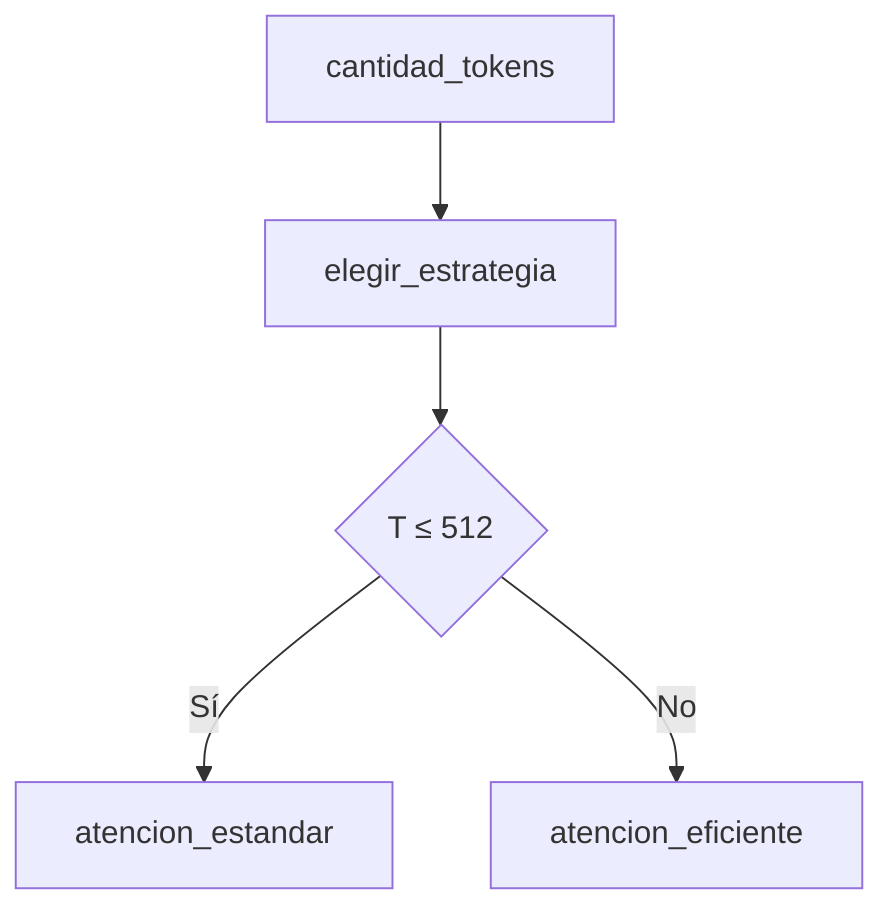

# 05 — Routing según longitud de secuencia

## Idea central

La atención estándar forma una matriz `T × T`. Este routing didáctico elige una estrategia según cantidad de tokens para conectar teoría de complejidad con una decisión visible.

## Recorrido del código

`EstadoTokens` recibe `cantidad_tokens`; el nodo agrega `estrategia`. La condición `<= 512` es una regla de demostración, no un límite universal de Transformers.

| Longitud | Estrategia del ejemplo | Razón pedagógica |
|---:|---|---|
| 128 | Estándar | Matriz relativamente pequeña. |
| 512 | Estándar | Límite definido por la regla. |
| 800 | Eficiente | `T²` comienza a ser más costoso. |

La forma real de optimizar puede incluir sparse attention, ventanas, paginación, FlashAttention o recorte de contexto. El objetivo de este archivo es identificar el motivo: la atención completa no escala linealmente con tokens.

## Práctica

Probá 511, 512 y 513. Explicá por qué un routing de producción también debería mirar memoria disponible, modelo, batch y latencia permitida.
