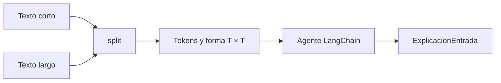

# 06 — Agente LangChain que compara dos secuencias

## Idea central

Este caso compara una frase corta con otra larga. Python calcula tokens didácticos y forma de atención; el agente convierte las métricas en una explicación tipada. Así se observa cómo crecer la entrada afecta la matriz de self-attention.



## Recorrido del código

### 1. Dos entradas contrastantes

La lista `textos` mantiene todo lo demás igual: se cambia la longitud de la frase. Eso permite atribuir el cambio de la matriz a `T`, número de tokens del ejemplo.

### 2. Schema de salida

```python
class ExplicacionEntrada(BaseModel):
    texto: str = ""
    tokens: list[str] = []
    forma_atencion: str = ""
    explicacion: str
```

El schema conserva evidencia (`texto`, `tokens`, `forma_atencion`) junto con interpretación. Los valores se vuelven a fijar desde Python después de la respuesta para que el agente no pueda modificar silenciosamente las métricas.

### 3. Métrica local antes del agente

```python
tokens = texto.split()
forma_atencion = f"({len(tokens)}, {len(tokens)})"
```

Esto es una simplificación sin batch ni heads. En un tensor real podría ser `(B, H, T, T)`, pero el cuadrado `T × T` hace visible el crecimiento de relaciones por secuencia.

| Frase | Tokens `T` | Pesos por head aproximados |
|---|---:|---:|
| Corta | 4 | 16 |
| Larga | Depende de palabras | `T²` |

### 4. Agente y doble validación

`create_agent(..., response_format=ExplicacionEntrada)` solicita estructura. `model_validate({...})` mezcla la explicación con el texto y métricas locales, dejando esos valores bajo control de Python.

## Práctica

Agregá una palabra a la primera frase. Primero predecí el cambio: `T` aumenta en 1, pero los pesos cambian de `T²` a `(T+1)²`.
