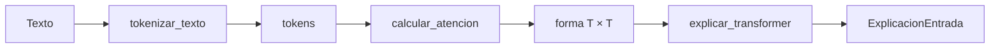

# 07 — Grafo completo: texto → tokens → atención → explicación

## Idea central

Este integrador separa tres pasos que a menudo se mezclan: tokenizar, calcular la forma de atención y explicarla. LangGraph guarda resultados intermedios para que el recorrido sea auditable.



## Recorrido del código

### 1. Estado y handoffs

```python
class EstadoTransformer(TypedDict):
    texto: str
    tokens: NotRequired[list[str]]
    forma_atencion: NotRequired[str]
    explicacion: NotRequired[dict[str, object]]
```

El estado inicial solo tiene texto. Cada nodo añade una actualización tipada: primero tokens, luego forma, por último explicación. Por eso se puede demostrar que el LLM recibió métricas producidas por cálculo previo.

### 2. Primer nodo: tokenizar

`tokenizar_texto` usa `split()` para una demostración transparente. En un Transformer real reemplazarías este nodo por un `AutoTokenizer`, pero la interfaz seguiría siendo “texto entra, tokens salen”.

### 3. Segundo nodo: calcular relación cuadrada

```python
cantidad_tokens = len(state.get("tokens", []))
return {"forma_atencion": f"({cantidad_tokens}, {cantidad_tokens})"}
```

La matriz didáctica contiene una fila por token que consulta y una columna por token al que puede atender. No calcula pesos todavía; calcula la dimensión que tendría el mecanismo.

### 4. Tercer nodo: comunicar sin reescribir datos

El LLM produce una explicación estructurada. Después el código fuerza `texto`, `tokens` y `forma_atencion` a los valores guardados en estado. Esta es una práctica útil cuando el modelo genera lenguaje sobre valores medidos.

| Nodo | Fuente de verdad | Campo agregado |
|---|---|---|
| `tokenizar_texto` | Python | `tokens` |
| `calcular_atencion` | Python | `forma_atencion` |
| `explicar_transformer` | LangChain + Pydantic | `explicacion` |

## Práctica

Ejecutá el grafo con las dos frases incluidas. Compará cada estado final y localizá qué nodo sería responsable si la cantidad de tokens fuese incorrecta.
