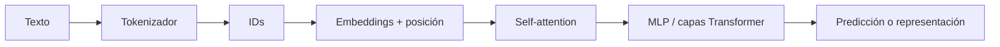

# Teoría transversal — L4: Transformers

## Recorrido general

## Conceptos esenciales

| Concepto | Definición corta | Confusión frecuente |
|---|---|---|
| Token | Unidad discreta de texto | Siempre equivale a una palabra. |
| ID | Número del vocabulario | Contiene significado por sí mismo. |
| Embedding | Vector aprendido de un token | Es una palabra legible. |
| Query / Key / Value | Proyecciones para atención | Son tres tokens diferentes. |
| Self-attention | Relación entre posiciones de una secuencia | Es una búsqueda literal. |
| Head | Patrón de atención paralelo | Es un modelo separado. |

## Fórmula básica

\[
Attention(Q,K,V) = softmax\left(\frac{QK^T}{\sqrt{d_k}}\right)V
\]

`QKᵀ` compara relaciones; `softmax` normaliza pesos; multiplicar por `V` mezcla información contextual. Con longitud `T`, la matriz de pesos por head es aproximadamente `T × T`.

## Rol de cada tecnología en los resúmenes

| Tecnología | Rol |
|---|---|
| PyTorch | Tensores, embeddings y atención. |
| Hugging Face | Tokenizadores y modelos preentrenados. |
| LangChain | Explicar resultados o integrar modelos. |
| LangGraph | Hacer visibles etapas y handoffs. |
| Pydantic | Estabilizar la forma de la salida. |

## Principio de L4

El LLM no reemplaza a un Transformer que calcula tensores. Puede explicarlos para una persona, pero los tokens, embeddings, pesos y métricas deben originarse en cálculo verificable.
