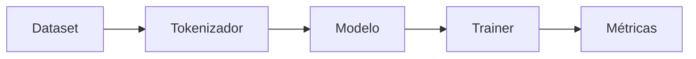

# 00 — Entrenamiento en CPU

## Objetivo

Este script prepara un entrenamiento pequeño en CPU para mostrar el ciclo dataset → modelo → `Trainer` sin requerir GPU.

| Concepto | Qué observar |
|---|---|
| Batch | Cuántos ejemplos procesa cada paso. |
| Epoch | Una pasada completa por entrenamiento. |
| CPU | Accesible, pero más lenta que GPU. |

## Práctica

Reducí ejemplos y epochs. Medí tiempo antes de aumentar escala; el objetivo es comprender el flujo, no entrenar un modelo grande.
