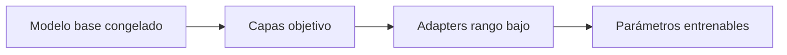

# 01 — LoRA con PEFT

## Objetivo

Este archivo agrega adapters LoRA a un modelo base para que solo una fracción pequeña de parámetros reciba gradientes.

LoRA aproxima una actualización de pesos mediante matrices pequeñas de rango `r`. Menor `r` reduce costo, pero puede limitar capacidad de adaptación.

| Parámetro | Decisión |
|---|---|
| `r` | Capacidad del adapter. |
| `target_modules` | Capas que reciben LoRA. |
| `requires_grad` | Qué pesos se entrenan. |

## Práctica

Contá parámetros antes y después. La decisión se evalúa con calidad y recursos, no solo por porcentaje entrenable.
