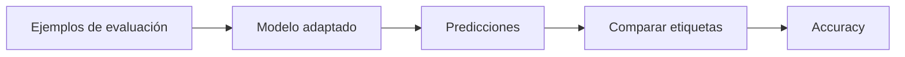

# 00 — Accuracy de una adaptación

## Objetivo

La accuracy compara predicción y etiqueta correcta en un conjunto de evaluación. Es una señal rápida para comprobar si la adaptación clasifica los ejemplos esperados.

\[
accuracy = \frac{predicciones\ correctas}{ejemplos\ totales}
\]

## Límite

No muestra qué clase falla ni si el dataset es representativo. Complementala con matriz de confusión y golden cases.
