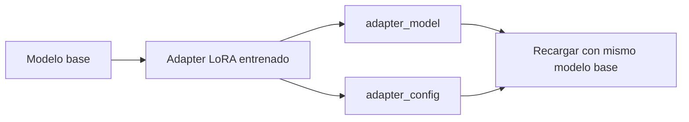

# 01 — Guardar el adapter

## Objetivo

Este ejercicio guarda solo el adapter LoRA y su configuración, no una copia completa del modelo base.

| Archivo | Rol |
|---|---|
| Pesos adapter | Cambios aprendidos. |
| Configuración | Cómo conectarlos al modelo base. |
| Modelo base | Debe ser compatible al recargar. |

## Práctica

Guardá en una carpeta nueva y anotá modelo base, dataset, métrica y fecha. Un adapter sin procedencia no es reproducible.
