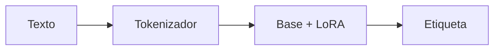

# Clasificador LoRA

## Objetivo

Este caso aplica un adapter para clasificar intenciones con un contrato pequeño de datos y muestra cómo una adaptación se usa después del entrenamiento.

## Preguntas de clase

| Pregunta | Evidencia |
|---|---|
| ¿Qué modelo base se usó? | Configuración del adapter. |
| ¿Qué cambió? | Pesos LoRA. |
| ¿Mejoró? | Accuracy y casos de prueba. |
| ¿Se puede servir? | Adapter guardado y carga reproducible. |
