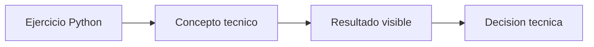

# Cadena LangChain para serving

## Objetivo

Probar prompt y modelo antes de exponerlos por HTTP.

## Como leer el codigo

Abri primero langchain\00_fundamentos\00_cadena_para_servingpy. Los comentarios del archivo separan preparacion, calculo o llamada principal y salida. Ejecutalo antes de modificarlo: relaciona cada variable con una decision de adaptacion o despliegue.

## Que explicar en clase

1. Que problema operativo resuelve el ejercicio.
2. Que supuesto simplifica el ejemplo y que dato real deberia medirse.
3. Como cambiaria la decision al modificar una sola variable.

## Practica

Cambia la consulta y diseña el schema del endpoint.

En produccion, valida la conclusion con metricas reales, pruebas de carga y observabilidad.

