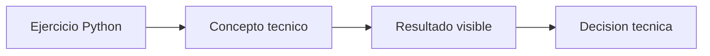

# Observacion automatica

## Objetivo

Registrar input y output de una funcion en Langfuse.

## Como leer el codigo

Abri primero langfuse\00_fundamentos\01_observepy. Los comentarios del archivo separan preparacion, calculo o llamada principal y salida. Ejecutalo antes de modificarlo: relaciona cada variable con una decision de adaptacion o despliegue.

## Que explicar en clase

1. Que problema operativo resuelve el ejercicio.
2. Que supuesto simplifica el ejemplo y que dato real deberia medirse.
3. Como cambiaria la decision al modificar una sola variable.

## Practica

Modifica la entrada y compara ambas observaciones.

En produccion, valida la conclusion con metricas reales, pruebas de carga y observabilidad.

