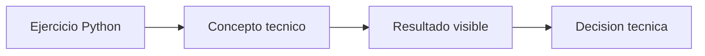

# Jerarquia de spans

## Objetivo

Medir preparacion, inferencia y validacion por separado.

## Como leer el codigo

Abri primero langfuse\01_spans\00_jerarquiapy. Los comentarios del archivo separan preparacion, calculo o llamada principal y salida. Ejecutalo antes de modificarlo: relaciona cada variable con una decision de adaptacion o despliegue.

## Que explicar en clase

1. Que problema operativo resuelve el ejercicio.
2. Que supuesto simplifica el ejemplo y que dato real deberia medirse.
3. Como cambiaria la decision al modificar una sola variable.

## Practica

Agrega un span de lectura y decide que input registrar.

En produccion, valida la conclusion con metricas reales, pruebas de carga y observabilidad.

