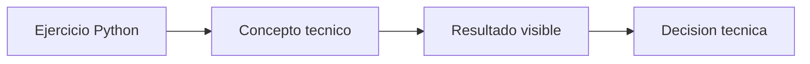

# Callback de Langfuse para LangChain

## Objetivo

Observar prompt, modelo, latencia y tokens sin reescribir la cadena.

## Como leer el codigo

Abri primero langfuse\02_integraciones\00_langchain_callbackpy. Los comentarios del archivo separan preparacion, calculo o llamada principal y salida. Ejecutalo antes de modificarlo: relaciona cada variable con una decision de adaptacion o despliegue.

## Que explicar en clase

1. Que problema operativo resuelve el ejercicio.
2. Que supuesto simplifica el ejemplo y que dato real deberia medirse.
3. Como cambiaria la decision al modificar una sola variable.

## Practica

Compara dos consultas y sus metricas.

En produccion, valida la conclusion con metricas reales, pruebas de carga y observabilidad.

