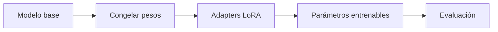

# 00 — Decidir LoRA antes de entrenar

## Idea central

LoRA adapta un modelo congelando pesos base y entrenando matrices pequeñas adicionales. Este caso no entrena: formaliza una decisión de adaptación con costo visible.

## Recorrido del código

`DecisionAdaptacion` separa técnica, cantidad entrenable y recomendación. `Field(ge=1)` impide informar un adapter vacío. `parametros_adapter=120_000` es una medida didáctica: en un experimento real se contaría desde los tensores del modelo.

La llamada LangChain genera una justificación, pero `tecnica` y `parametros_entrenables` se fijan en Python. Una explicación del LLM no demuestra ahorro de memoria ni calidad de adaptación.

| Estrategia | Pesos que cambian | Costo relativo | Control indispensable |
|---|---|---|---|
| Fine-tuning completo | Casi todo el modelo | Alto | Dataset, GPU/CPU y evaluación. |
| LoRA | Adapters de bajo rango | Menor | Comparar calidad y guardar adapter. |

## Práctica

Duplicá parámetros entrenables y preguntá: ¿sigue entrando en CPU?, ¿cuánto tarda?, ¿qué métrica demuestra que el adapter mejoró?
