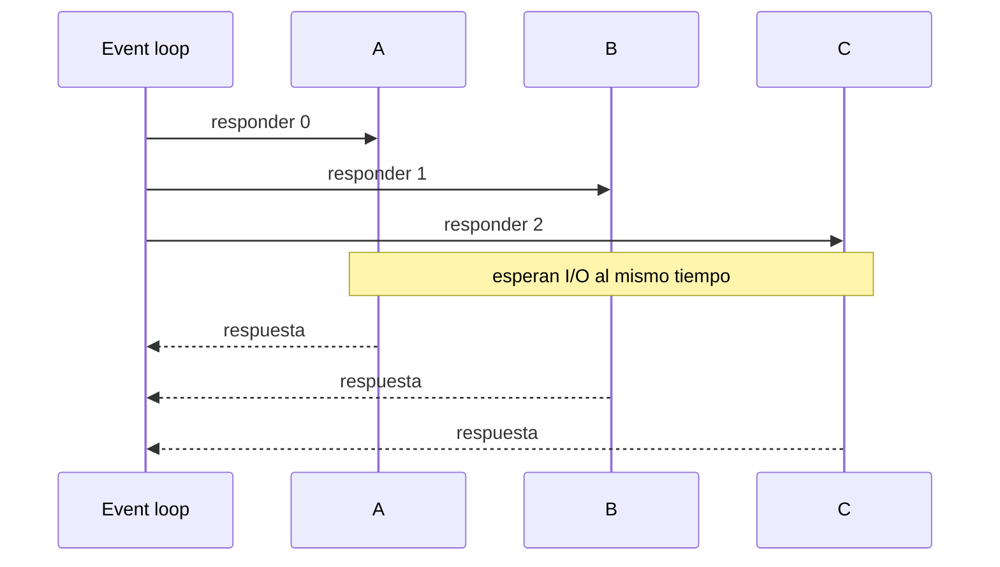

# 01 — Concurrencia antes de elegir infraestructura

## Idea central

Este caso simula tres operaciones de I/O con `asyncio`. Enseña que concurrencia reduce tiempo de espera cuando las tareas esperan red o disco; no acelera por sí sola cálculos pesados de CPU.

## Recorrido del código

`responder` es `async` y usa `await asyncio.sleep(0.02)`: representa una espera no bloqueante. `asyncio.gather` agenda las tres corrutinas; `asyncio.run` crea y cierra el loop para este script lineal. `perf_counter` mide el tiempo total del lote.

| Función | Responsabilidad |
|---|---|
| `responder` | Una solicitud simulada. |
| `gather` | Reunir tareas concurrentes. |
| `perf_counter` | Medir tiempo de pared. |
| LangChain | Explicar la medición, no producirla. |

## Límite

Si `responder` hiciera inferencia CPU pesada, el event loop no resolvería el cuello de botella. Habría que usar procesos, GPU, batching, cola o más réplicas.

## Práctica

Pasá de tres a seis solicitudes. Compará la latencia total con el caso secuencial hipotético de seis esperas de 20 ms.
