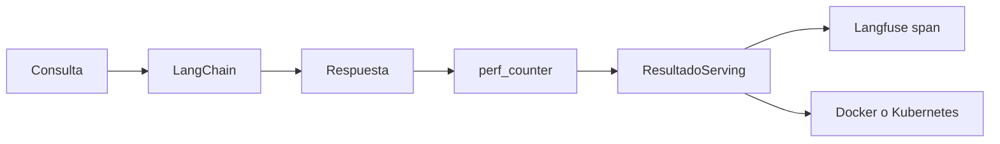

# 02 — Agente observable: respuesta, latencia y traza

## Idea central

Servir un agente no es solo responder. Este integrador conserva salida, mide latencia, propone destino y registra input/output con Langfuse.



## Recorrido del código

`perf_counter` rodea la llamada al modelo y produce milisegundos de pared. `ResultadoServing` fija los campos que un endpoint podría retornar. El umbral de 500 ms deriva a Kubernetes como regla didáctica; no sustituye un estudio de carga real.

```python
with langfuse.start_as_current_observation(...) as span:
    span.update(output=resultado.model_dump(), metadata={...})
langfuse.flush()
```

La observación guarda entrada, salida y metadata. `flush()` intenta enviar los eventos pendientes antes de terminar el script.

| Evidencia | Para qué sirve |
|---|---|
| Input | Reproducir la consulta. |
| Output | Revisar la respuesta entregada. |
| Latencia | Detectar degradación. |
| Destino | Auditar la regla de despliegue. |

## Práctica

Cambiá el umbral y explicá por qué una sola latencia no justifica escalar: se necesitan percentiles, carga sostenida, costo y tasa de error.
