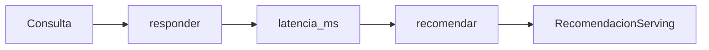

# 03 — LangGraph: medir y recomendar serving

## Idea central

El grafo separa una llamada que mide latencia de otra que recomienda arquitectura. La separación convierte una recomendación de despliegue en un handoff visible y revisable.

## Recorrido del código

`EstadoServing` comienza con `consulta`; `latencia_ms` y `recomendacion` son resultados de nodos posteriores. `responder` inicia reloj, invoca LangChain y devuelve solo la latencia. `recomendar` recibe ese valor y produce una salida Pydantic.

| Nodo | Calcula | No debería hacer |
|---|---|---|
| `responder` | Latencia observada | Elegir infraestructura. |
| `recomendar` | Explicación y destino | Inventar la latencia. |

La arista `START → responder → recomendar → END` impide recomendar antes de medir. Aun así, una medición única es evidencia débil: este caso enseña arquitectura de flujo, no benchmarking completo.

## Práctica

Hacé que `responder` devuelva también un código de error simulado. ¿Qué nodo adicional crearías para derivar fallas a revisión?
