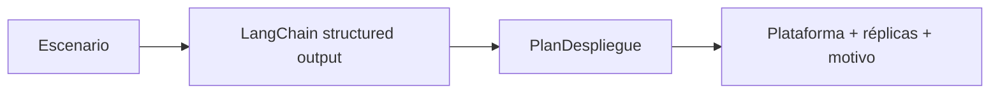

# 04 — Asesor tipado de despliegue

## Idea central

El LLM convierte un escenario de tráfico y latencia en una propuesta de plataforma, réplicas y motivo. Pydantic asegura forma; una persona debe validar que la recomendación sea económicamente y técnicamente viable.

## Recorrido del código

`escenario` contiene demandas simples. El schema obliga a escoger tres campos, pero no restringe aún plataforma a valores permitidos ni réplicas a un mínimo. Una versión más estricta usaría `Literal["Docker", "Kubernetes"]` y `Field(ge=1)`.

| Variable | Pregunta que responde |
|---|---|
| Solicitudes por minuto | ¿Cuánto tráfico sostener? |
| Latencia objetivo | ¿Qué espera el usuario? |
| Carga variable | ¿Hace falta escalar? |
| Réplicas | ¿Cuánta capacidad inicial proponer? |

## Límite

El modelo no conoce métricas reales de CPU, memoria, cold start o costo de tu entorno. La respuesta es una hipótesis que debe contrastarse con pruebas de carga.
