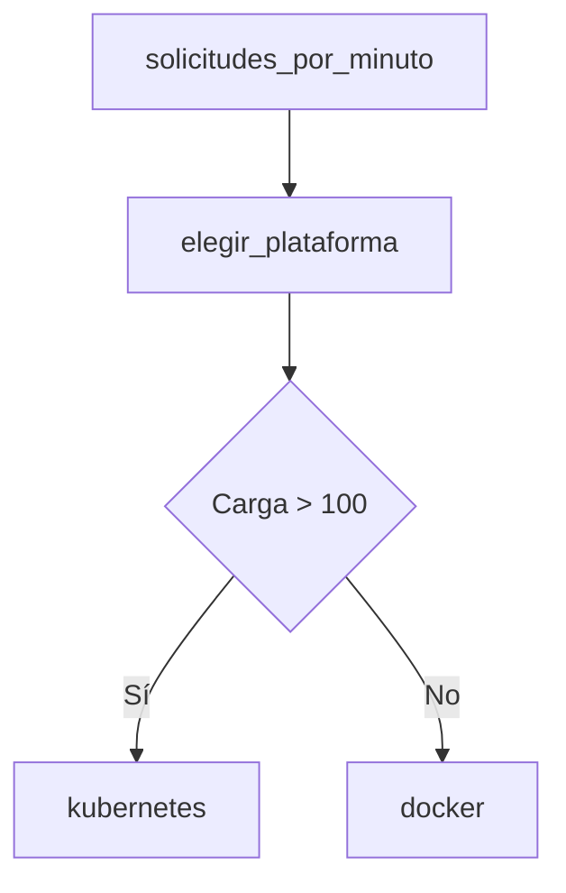

# 05 — Routing de arquitectura por carga

## Idea central

Este grafo muestra una regla transparente: por encima de 100 solicitudes por minuto se deriva a Kubernetes; por debajo, Docker. La regla es deliberadamente simple para discutir sus límites.

`EstadoServing` entra con volumen y suma `destino`. El nodo retorna una actualización, no todo el estado. Eso permite probar 100 y 101 para comprobar el borde.

| Carga | Resultado | Limitación |
|---:|---|---|
| 20 | Docker | Ignora tamaño de modelo. |
| 100 | Docker | La condición es estrictamente mayor. |
| 300 | Kubernetes | Ignora presupuesto y experiencia operativa. |

## Práctica

Agregá latencia objetivo y memoria de modelo al estado. Discutí por qué una única métrica no basta para una decisión real.
