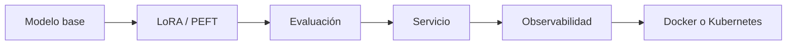

# Teoría transversal — L5: adaptación y despliegue

| Tema | Pregunta central | Evidencia |
|---|---|---|
| LoRA | ¿Qué pesos conviene entrenar? | Parámetros entrenables y calidad. |
| Evaluación | ¿La adaptación mejoró? | Métrica y golden cases. |
| Concurrencia | ¿Cómo se comportan varias solicitudes? | Latencia total y percentiles. |
| Serving | ¿Dónde publicar? | Carga, costo, memoria y SLO. |
| Langfuse | ¿Qué ocurrió en cada ejecución? | Trazas, input, output, tokens, errores. |
| Docker | ¿Cómo empaqueto de modo reproducible? | Imagen, variables, health check. |
| Kubernetes | ¿Cómo opero y escalo? | Réplicas, probes y recursos. |

## Principio de L5

Adaptar un modelo no termina al guardar pesos. Una solución profesional mide calidad, sirve el resultado de forma reproducible, observa latencia y errores, y escala según evidencia, no según una intuición del LLM.
